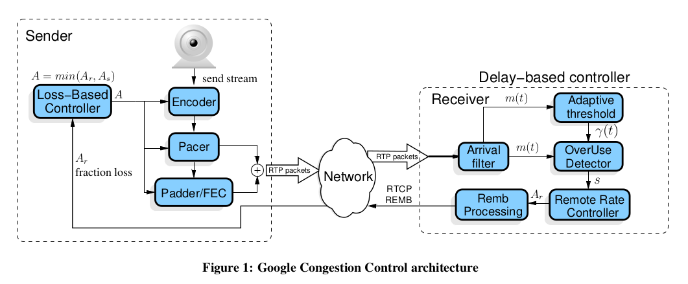
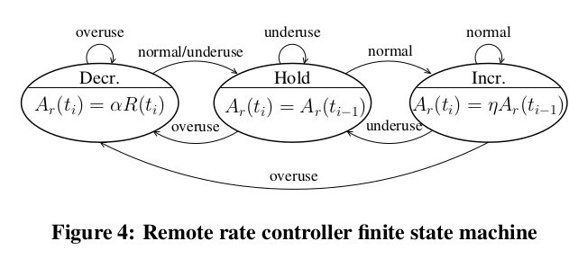
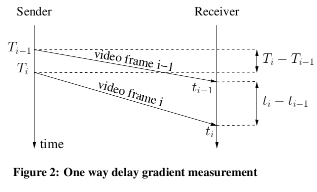
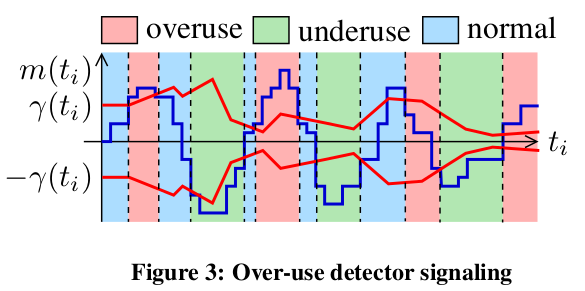

# Google Congestion Control for WebRTC

发送方发送利用UDP发送RTP，并收到接受方反馈的RTCP报文

1. 在接收方中，会放置一个基于延迟的控制器，计算Ar，并把Ar反馈给发送方，Ar可以理解为延迟
2. 在发送方，会放置一个基于丢包的控制器，他会计算出一个不高于Ar的发送比特率As

## The delay-based controller 基于延迟的控制器

接收方会根据如下公式计算出Ar
$$
A_{r}\left(t_{i}\right)= \begin{cases}\eta A_{r}\left(t_{i-1}\right) & \sigma=\text { Increase } \\ \alpha R_{r}\left(t_{i}\right) & \sigma=\text { Decrease } \\ A_{r}\left(t_{i-1}\right) & \sigma=\text { Hold }\end{cases}
$$
η =1.05, α = 0.85 Rr是之前500ms的接收速率

Remote Rate Controller是一个有限状态自动机，会根据OverUse Detector的输出s改变sigma的状态，而s的输出基于Arrival filter的m(t)。Adaptive threshold产生的阈值y(t)也会由OverUse Detector使用。

REMB Processing 会根据Ar的结果发送REMB数据包，Ar的上限是1.5Rr

### The arrival-time filter

这个模块会产生一个单向延迟梯度的评估数值m(ti)

因此引入dm(ti)来计算m(ti)
$$
d_{m}\left(t_{i}\right)=\left(t_{i}-t_{i-1}\right)-\left(T_{i}-T_{i-1}\right)
$$

### The over-use detector

每次收到ti后，就会产生信号s驱动Remote rate controller

s产生方式如下

### Remote rate controller

根据公式计算Ar
$$
A_{r}\left(t_{i}\right)= \begin{cases}\eta A_{r}\left(t_{i-1}\right) & \sigma=\text { Increase } \\ \alpha R_{r}\left(t_{i}\right) & \sigma=\text { Decrease } \\ A_{r}\left(t_{i-1}\right) & \sigma=\text { Hold }\end{cases}
$$

### Adaptive threshold

$$
\gamma\left(t_{i}\right)=\gamma\left(t_{i-1}\right)+\Delta T \cdot k_{\gamma}\left(t_{i}\right)\left(\left|m\left(t_{i}\right)\right|-\gamma\left(t_{i-1}\right)\right)
$$

### REMB Processing

将计算出的Ar放入REMB包（REMB是RTCP协议的扩展）中发送。每秒定时发送，或Ar下降率超过3%会立即发送

## The loss-based controller

$$
A_{s}\left(t_{k}\right)= \begin{cases}A_{s}\left(t_{k-1}\right)\left(1-0.5 f_{l}\left(t_{k}\right)\right) & f_{l}\left(t_{k}\right)>0.1 \\ 1.05\left(A_{s}\left(t_{k-1}\right)\right) & f_{l}\left(t_{k}\right)<0.02 \\ A_{s}\left(t_{k-1}\right) & \text { otherwise }\end{cases}
$$

As就是发送速率，当丢包率<0.02%时，发送速率增加5%，丢包率>0.1%时，发送速率变为原发送速率的（1-0.5*丢包率）。