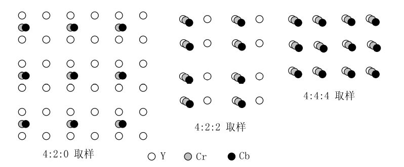
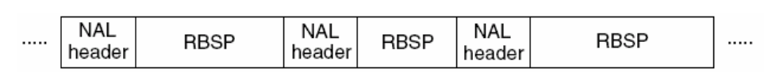
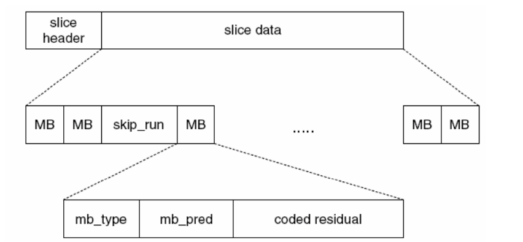
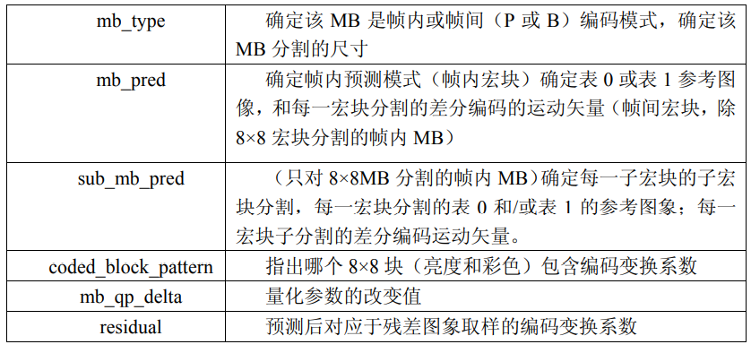
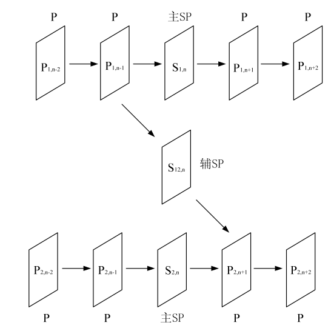
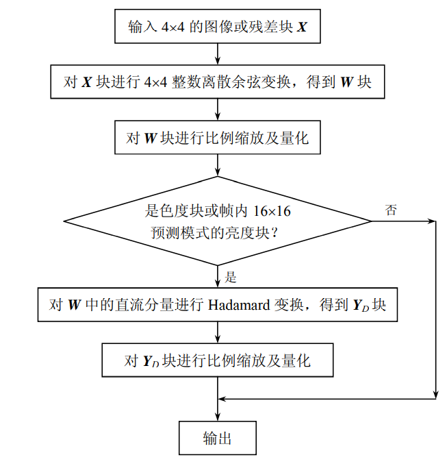
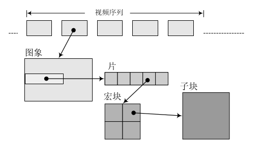
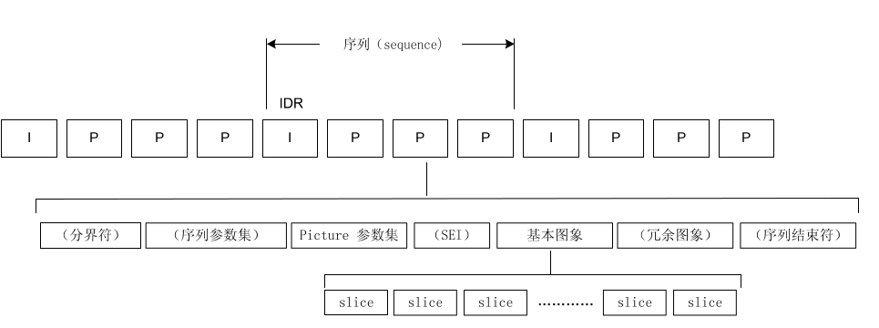
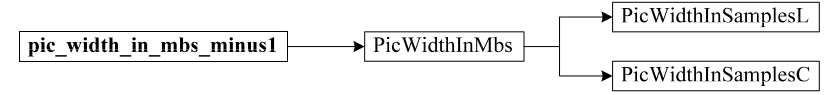

# H.264

## 概念
### YUV YCrCb
YUV来自于RGB模型，将亮度和色度分开。Y表示亮度，UV表示色差。  
YCrCb来自于YUV，应用于数字视频。Y表示亮度，Cb表示蓝色色度分量，Cr表示红色色度分量。  
每一种彩色空间都会产生一种亮度分量信号和两种色度分量信号  
YUV适用于PAC和SECAM彩色电视制式，YCrCb适用于显示器  
Y=0.299R+0587G+0.114B  
Cb=0564(B－Y)   
Cr=0.713(R－Y)  
R=Y+1.402Cr   
G=Y-0.344Cb-0.714Cr   
B=Y+1.772Cb   

对于数字信号，YUV等同于YCrCb

#### 引入YUV的原因
人眼对Y更敏感，因此可以保证Y的情况下适当舍弃UV。

单独的Y可以兼容老式黑白电视信号

#### 4:4:4 4:2:2 4:2:0 
1. 4:4:4，Y，Cb 和 Cr 具有同样的水平和垂直清晰度，在每一像素位置，都有 Y，Cb 和 Cr分量，即不论水平方向还是垂直方向，每 4 个亮度像素相应的有 4 个 Cb 和 4 个 Cr 色度像素。  
2. 4:2:2，这时彩色分量和亮度分量具有同样的垂直清晰度，但水平清晰度彩色分量是亮度分量的一半。水平方向上，每 4 个亮度像素具有 2 个 Cb 和 2 个 Cr。在 CCIR601 标准中，这是分量彩色电视的标准格式。  
3. 4:2:0，在水平和垂直清晰度方面，Cb 和 Cr 都是 Y 的一半。  

#### 量化深度

传统的图像每个颜色空间用8bit表示，因此只有256个灰度等级，动态范围小

## 3 视频压缩编码的基本原理
### 3.1 预测编码
#### 3.1.1 基本概念
传递像素预测值与实际值之差的信号。因为大量统计表明，同一幅图像的邻近像素之间有着相关性，或者说这些像素值相似。对于接收端，差值q与预测值A相加得到原始值X。  
编码端：X－A=q  
解码端：q＋A=X

#### 3.1.2 帧内预测
原理，相邻的像素相关性越大，差值越小，因此可以进行压缩  
主要手段：

1. 一维最佳预测
2. 二维最佳预测
#### 3.1.3 帧间预测
单向预测，根据前面的参考帧得到当前帧  
双向预测，根据前后的参考帧得到当前帧  
H.264的参考帧可以达到5-15帧

#### 3.1.4 运动估计
在帧间预测编码中，由于活动图像邻近帧中的景物存在着一定的相关性。因此，可将活动图像
分成若干块或宏块，并设法搜索出每个块或宏块在邻近帧图像中的位置，并得出两者之间的空间位
置的相对偏移量，得到的相对偏移量就是通常所指的运动矢量，得到运动矢量的过程被称为运动估
计。

### 3.2 变换编码
#### 3.2.1 变换编码的基本概念
平坦区域和内容缓慢变化区域占据一幅图像的大部分，而细节区域和内容突变区域则占小部分。也可以说，图像中直流和低频区占大部分，高频区占小部分。这样，空间域的图像变换到频域或所谓的变换域，会产生相关性很小的一些变换系数，并可对其进行压缩编码，即所谓的变换编码。  
常用的变换手段有K-L变换和离散余弦变换DCT变换。  
最理想的变换操作应对整个图像进行，以便去除所有像素间的相关性。但这样的操作计算量太大。实际上，往往把图像分为若干块，以块为单位进行 DCT 变换。通常区 16×16或 8×8 组成小块。

#### 3.3.3 熵编码
经过K-L或者DCT后，低频部分会有较大的值，而高频部分会有较小的值。因此，可以对高频部分进行熵编码，从而减少编码后的空间。  
常用哈夫曼或者游程编码
游程编码：将变换后的系数进行锯齿形扫描会得到一个序列  
例如：15，0，0，-3，4，5，0，0，0，0，-7，0，0，0.......
（0的个数（游程），系数值，其后是否全为0）  
编码后的值：  
（0，15，0），（2，-3，0），（0，4，0），（0，5，0），（4，-7，1）  
现常用的遍满框架为对图像先进行带有运动补偿的帧间预测编码，再对预测后残差信号进行 DCT变换  

## H.264
### H.264 编码器
编码器采用的仍是变换和预测的混合编码法。
输入的帧Fn以宏块为单位（16x16）
## 6.3 H.264 结构
#### 6.3.1 名词解释

1. 场和帧  
   一帧分为隔行的场
2. 宏块和片  
   一个图像分为若干宏块，每个宏块的大小为16x16像素和附加一个个 8×8 Cb和一个 8×8 Cr 彩色像素块组成。**I 片只包含 I 宏块，P 片可包含 P 和 I 宏块，而 B 片可包含 B 和 I 宏块。**

#### 6.3.2档次和级

1. 基本档次：I和P主要用于实施通讯
2. 主要档次：IPB用于数字广播电视和存储
3. 扩展档次：额外支持SP和SI片

#### 6.3.3 编码数据格式

##### 6.3.3.1 视频格式

支持4:2:0连续或者或隔行视频的编码和解码

##### 6.3.3.2 编码格式

划分为两层，视频编码层VCL和网络提取层NAL

VCL数据是编码后的输出，VCL数据在传输或者存储之前会封装进NAL单元中

每个NAL单元包括括一个原始字节序列负荷（RBSP）、一组对应于视频编码数据的 NAL 头信息。

#### 6.3.5 片和片组

##### 6.3.5.1 片

一个视频分为一个或多个帧，每帧包含整数个宏块（MB），即每片最少1个MB，最多时包含整个图像的宏块。因此每帧包含宏块数不确定。

slice header

##### 6.3.5.2 片组

片组是一个编码图象中若干 MB 的一个子集，它可包含一个或若干个片

### 6.4 帧内预测

根据宏块大小有不同的预测方式

4x4大小的子块有9种预测方式，16x16的宏块有4种预测模式

子块适用于带有大量细节的图像编码，宏块适用于变化较少的图像，具体由编码器自动处理

1. 4x4亮度预测模式

​        每次预测会根据左方和上方已编码的像素进行预测，编码器会根据9种模式的SAE（预测误差），选取SAE最小的模式进行预测

2. 16x16亮度预测模式
3. 8x8色度块预测模式，使用色度进行预测
4. 信号化帧内预测模式

### 6.5 帧间预测

相较于之前的标准，264的块尺寸变化更大从16x16到4x4，亚像素运动矢量的运用

1. 树状结构运动补偿

2. 运动矢量
3. MV（预测差异）预测
4. B 片预测
5.  加权预测

### 6.6 SP/SI帧

SP帧同P帧类似，基于帧间预测的运动补偿预测编码，但SP帧能够参照不同的参考帧重构出相同的图像帧。SP帧可以取代I帧。编码效率略低于P帧但远高于I帧 。

SI 帧则是基于帧内预测编码技术，其重构图像和对 SP 的重构图像完全相同.

#### 流间切换

正常的流间切换由于相同时刻的帧的编码参数不同，因此当切换码流之后，切换后的P帧的参考帧是编码参数不同的P帧，因此不能完全正确解码这一帧。所以常用的方法是周期性的放置I帧，且旨在I帧的时候切换

SP 帧使用不同的参考帧作预测，也可以得到完全相同的解码帧。

从P1到P2切换流的时候，需要发送一个辅SP帧，辅SP包括P1流和P2流同一帧的信息

即不切换时用主SP传输，切换时传输辅SP帧

### 6.7 整数变换与量化

图像信号压缩的一般方法为去除图像信号的相关性及减小图像编码的动态范围，通常采用变换编码及量化。变换编码将图像时域信号变换成频域信 号，在频域中图像信号能量大部分集中在低频区域，相对时域信号，码率有较大的下降。H.264 对 图像或预测残差采用了 4×4 整数离散余弦变换技术。

通常，量化和变换编码是两个独立的过程，H.264中，将两个过程的乘法合二为一，并进行其他运算。峰值信噪比（PSNR）很小，小于0.02dB.

其中量化原理为
$$
FQ=round(y/QP)
$$
y 为输入样本点编码，QP 为量化步长，FQ 为 y 的量化值，round()为取整函数（其输出为与 输入实数最近的整数）

反量化
$$
y'=FQ*QP
$$
量化步长QP决定压缩率和图像精度。QP大则量化值FQ的动态范围小，编码长度小，但损失大量细节

编码器会根据图像的实际动态范围自动改变QP，以获取更好的效果

量化步长从0-51之间取值，规定亮度QP最大为51，色度QP为亮度的80%即39

### 6.8 CAVLC(基于上下文自适应的可变长编码) 

### CABAC

## 流程 

### 划分宏块

8x8 16x16

### 计算像素值

### 划分子块

可以是16x16 16x8 8x8 4x8 4x4

### 帧内压缩

### 帧间压缩

**在相邻几幅图像画面中，一般有差别的像素只有10%以内的点,亮度差值变化不超过2%，而色度差值的变化只有1%以内，我们认为这样的图可以分到一组。**

第一帧可以是I帧也可以是IDR帧

### 帧内预测

原始图像与预测后图像相减得到残差

将预测模式和

## 7 H.264 的句法和语义

### 7.1 句法

数据的基本单位是句法，由bit组成，表示宏块类型，量化参数

#### 7.1.1 句法元素的分层结构 

图象句法元素包括子元素的公共信息，下一级的句法元素只包含自己独有的信息

序列和图像头部的大部分句法元素形成序列参数集和图像参数集，剩余的部分放入片中。片需要的时候会引用参数集，但参数集不引用片，只引用参数集。因此参数集是独立的。H.264建议参数集可以放入更安全的信道中传输。

每个片需要携带关于引用图像的所有信息，因此冗余度会增加，但同时也增加的信道的健壮性，因为片的丢失不影响其他片的解码，可以防止错误的扩散。

IDR图像，立即刷新图像，遇到IDR后参考帧队列会刷新，已解码的数据全部输出或抛弃，开始新的序列。IDR之后的图像永远不会引用IDR之前的图像数据解码。IDR一定是I帧，但I帧不一定是IDR

#### 7.1.2 句法的表示方法

#### 7.1.2.1 句法元素与变量

小写加下划线是句法元素，大写开头无下划线是中间变量

#### 7.1.2.2 语法

类似C的语法，提供if else，do while，while，for语句

#### 7.1.2.3 描述子

从比特流中还原提取句法元素的算法

由于最后一步为熵编码，因此大部分算法都是熵编码的解码算法

1. ae(v) 基于上下文自适应的二进制算术熵编码
2. b(8) 读进连续的 8 个比
3. ce(v) 基于上下文自适应的可变长熵编码
4. f(n) 读进连续的 n 个比特
5. i(n)/i(v) 读进连续的若干比特，并把它们解释为有符号整数
6. me(v) 映射指数 Golomb 熵编码
7. se(v) 有符号指数 Golomb 熵编码
8. te(v) 截断指数 Golomb 熵编码
9. u(n)/u(v) 读进连续的若干比特，并将它们解释为无符号整数
10. ue(v) 无符号指数 Golomb 熵编码

n为定长元素，v为变长

### 7.2 句法表

### 7.3 NAL层语义

网络传输时，NAL独立完整的放入一个分组，因此哪怕NAL没有头部也可以正确划分。但存放在介质中时，会添加0x000001的头部。

为了寻址方便，要求数据流在长度上对齐，因此会在起始码前添加若干字节0作为填充。H.264规定，检测到0x000000表示NAL结束。

为防止内部出现0x000000或0x000001，因此当检测到0x000000~0x000003时会在最后一个字节前插入0x03变成0x00000300~0x00000303

